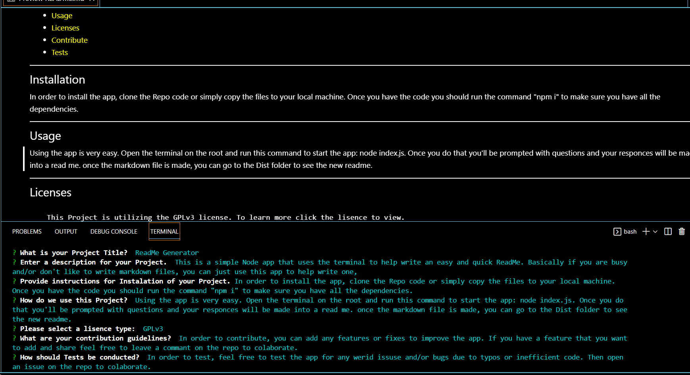

# ReadMe Generator
  
  ## Description
  This is a simple Node app that uses the terminal to help write an easy and quick ReadMe. Basically if you are busy and/or don't like to write markdown files, you can just use this app to help write one.
  Video Link: https://drive.google.com/file/d/11olx1ymzuiNU1ng0YeqmK0gZwLLyja8G/view
  
  
___
  ## Table of Contents
  * [Installation](#installation)
  * [Usage](#usage)
  * [Licenses](#licenses)
  * [Contribute](#contribute)
  * [Tests](#tests)
  ___
  ## Installation
  In order to install the app, clone the Repo code or simply copy the files to your local machine. Once you have the code you should run the command "npm i" to make sure you have all the dependencies.
  ___
  ## Usage
  Using the app is very easy. Open the terminal on the root and run this command to start the app: node index.js. Once you do that you'll be prompted with questions and your responces will be made into a read me. once the markdown file is made, you can go to the Dist folder to see the new readme.
  ___
  ## Licenses
  
      This Project is utilizing the GPLv3 license. To learn more click the lisence to view.
  ___
  ## Contribute
  In order to contribute, you can add any features or fixes to improve the app. If you have a feature that you want to add and share feel free to leave a commant on the repo to colaborate.
  ## Tests
  In order to test, feel free to test the app for any werid issuse and/or bugs due to typos or inefficient code. Then open an issue on the repo to colaborate.
  ___
  ## Have Questions? Contact Me!
  
  Visit my GitHub: DiegoCamilli
  Contact me via Email at: camillidiego011@gmail.com

